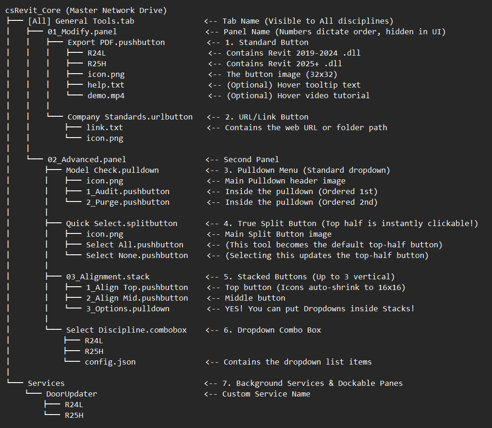

# 🏗️ Ribbon Generation & Master Folder Tree Architecture

The **csRevit Framework** completely bypasses legacy, hardcoded UI development. Instead of writing complex C# presentation layer code or dealing with rigid XML configurations, your development team constructs and manages your entire enterprise Revit interface using standard Windows directory structures.

---

## 🗺️ Master Blueprint Directory Layout

Below is the master folder tree architecture required by the sync engine to dynamically build your custom Revit interface.

---

## 📐 Natural UI Sort Order Rules

To give your BIM management team absolute control over user-interface aesthetics, the csRevit Microkernel handles ordering using a clean, non-destructive sorting engine:

* **Smart Numbering Prefix:** Force the exact left-to-right (Tabs and Panels) or top-to-bottom (Pulldowns and Stacks) spatial ordering by prefixing your directories with numeric tags (e.g., `01_`, `02_`, `10_`).
* **Natural Alpha-Numeric Sorting:** The engine natively understands double-digit increments. It correctly processes that a folder prefixed with `10_` sorts sequentially after `09_`, completely avoiding standard ASCII character alignment bugs.
* **Automatic Strip Engine:** The framework strips these numerical management prefixes out entirely during mid-session compilation. For example, a directory named `01_Worksets.panel` will render beautifully on the end-user's Revit Ribbon simply as **"Worksets"**.

---

## 🗂️ Folder Suffix Mapping System

The sync engine continuously monitors your master directory paths. The extension applied to a folder dictates exactly how the microkernel translates that folder into native Revit UI elements:

* `.tab` — Generates a completely new primary standalone Ribbon Tab inside Autodesk Revit.
* `.panel` — Creates a distinct, structural panel grouping within its parent tab.
* `.pushbutton` — Registers an instantly clickable standard execution command button.
* `.pulldown` — Renders a sleek vertical dropdown context menu container for grouping tools.
* `.splitbutton` — Instantiates a dynamic split-action button where the primary top half automatically changes to mirror your team's last-used action item.
* `.stack` — Compresses up to three individual tools vertically, maximizing precious on-screen design real estate.

### 🎭 Discipline Filtering
To reduce visual clutter for multi-disciplinary engineering firms, you can explicitly restrict tab visibility. If an end-user configures their Global Settings to "Architecture", the framework selectively loads only the tabs matching that profile.
* Use `[Architecture]` or `[Structure]` in the folder name to target specific roles.
* Use `[All]` to make a ribbon tab universally visible across your entire organization.

---

## 🔬 Anatomy of a Tool Folder

Once an automation tool folder is initialized (e.g., `01_AlignElements.pushbutton`), it serves as a self-contained environment bundle. To execute seamlessly across your enterprise, it can house the following structured assets:

| Asset Name | Status | Purpose & Engine Execution Behavior |
| :--- | :--- | :--- |
| **`R24L`** (Folder) | **Required** | Holds the compiled **.NET Framework 4.8** binaries (`.dll`) targeting Revit 2024 and older legacy versions. |
| **`R25H`** (Folder) | **Required** | Holds the compiled, high-performance **.NET 8.0** binaries (`.dll`) targeting Revit 2025 and modern newer engines. |
| **`icon.png`** | **Required** | The primary 32x32 pixel image asset for the ribbon button. *(Note: If this folder is nested inside a `.stack` container, the framework will automatically shrink this image to 16x16 pixels safely without distortion)*. |
| **`config.json`** | **Conditional** | Required **only** if the tool is mapped as a ComboBox dropdown list. It houses the selectable array items. |
| **`help.txt`** | *Optional* | Plain text content that the framework automatically maps into a native **F1 Extended Tooltip** menu inside Revit. |
| **`demo.mp4`** | *Optional* | A compressed, short video asset that automatically plays as an animated tooltip preview when a user hovers over the ribbon button. |
| **`class.txt`** | *Optional* | Used explicitly for Multi-Tool DLL bundles. If a single compiled assembly contains multiple individual commands, this text instruction explicitly maps the entry point C# Class Name to this specific folder. |

---

## 🛠️ Enterprise Asset Support
For custom multi-version compilation configurations, centralized script compilation pipelines, or enterprise IT security inquiries regarding binary folder validation, please contact your SVECS engineering desk directly:
📩 **Email Support:** [support@svecs.in](mailto:support@svecs.in)
